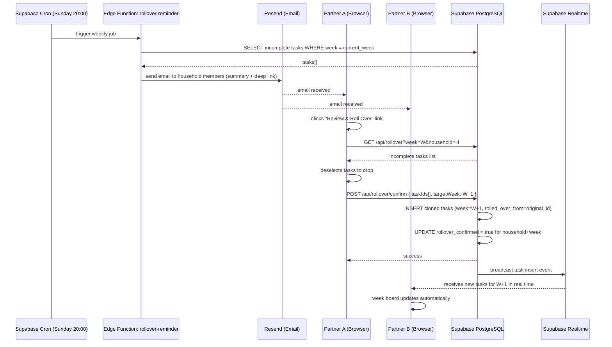
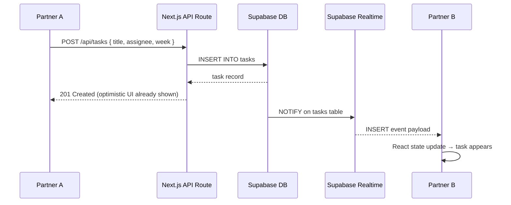
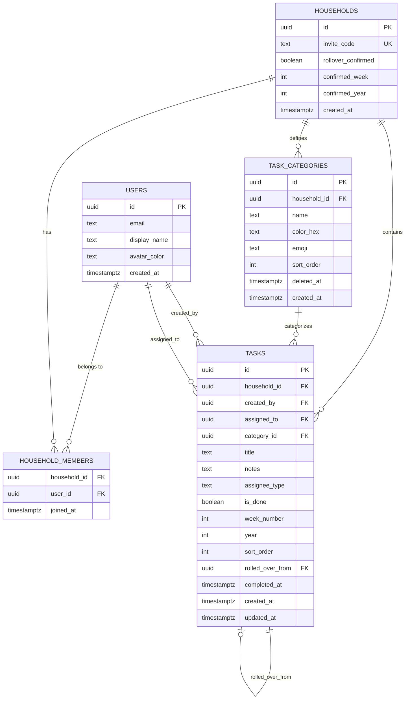

# PRD: Couple Weekly Todo — *WeekSync*

> **Version:** 1.1 — MVP + Task Categories
> **Stack:** Next.js 14 (App Router) · Supabase (Auth + DB + Realtime) · Vercel (free tier)
> **Audience:** 2-person household (private, invite-only)
> **Budget:** $0 — all free tier

---

## 1. Overview

### Problem

Couples who manage shared household tasks via WhatsApp chats face a recurring pain point: unfinished tasks silently disappear at the end of each week. There is no structured rollover, no ownership tracking, and no way to reflect on what actually got done over time.

### Solution

**WeekSync** is a lightweight, real-time synchronized web app exclusively for two people. It replaces the WhatsApp to-do list with a structured weekly board that:

- Lets both partners create, assign, and complete tasks.
- Automatically detects unfinished tasks at week's end and prompts a rollover confirmation.
- Provides a monthly/yearly summary dashboard to review patterns.

### Goals (MVP)

| Goal | Metric |
|---|---|
| Zero missed task rollover | 100% of unchecked tasks surfaced in rollover prompt |
| Real-time sync between partners | Changes visible within < 1s via Supabase Realtime |
| Zero infra cost | Deploy on Vercel + Supabase free tier |

### Non-Goals (v1)

- Mobile native app (PWA is acceptable)
- More than 2 users per workspace
- Third-party calendar integration
- Push notifications (email reminder is sufficient for MVP)

---

## 2. Requirements

### Functional Requirements

| ID | Requirement | Priority |
|---|---|---|
| F-01 | Users can sign up/login via magic link email (no password) | Must |
| F-02 | Two users form a shared "household" by one inviting the other | Must |
| F-03 | Tasks have: title, assignee (me / partner / both), due week, status (todo/done) | Must |
| F-04 | Both users see and edit the same task list in real time | Must |
| F-05 | Current week view is the default landing screen | Must |
| F-06 | Every Sunday at 8 PM local time, both users receive an email: "You have X unfinished tasks. Roll over?" | Must |
| F-07 | Either partner can confirm rollover from within the app; unfinished tasks clone into next week | Must |
| F-08 | Monthly summary: tasks created, completed, rolled-over, broken down by assignee | Must |
| F-09 | Yearly summary: month-by-month completion rate chart | Must |
| F-10 | Tasks can have optional notes (plain text, max 500 chars) | Should |
| F-11 | Tasks can be re-ordered via drag-and-drop within the week | Could |
| F-12 | Household can create custom task categories (name + color + emoji) | Must |
| F-13 | A category can be optionally attached to a task at creation or edit time | Must |
| F-14 | Week board can be filtered by one or more categories | Should |
| F-15 | Summary dashboard breaks down completed/rolled-over tasks by category | Should |

### Non-Functional Requirements

- **Latency:** Real-time updates < 1s on stable connection (Supabase Realtime WebSocket).
- **Auth security:** Email magic link; sessions expire after 7 days.
- **Data isolation:** Each household's data is row-level secured (Supabase RLS) — no cross-household reads.
- **Availability:** Vercel free tier (sufficient for 2 users).
- **Accessibility:** WCAG 2.1 AA minimum (keyboard nav, sufficient contrast).

---

## 3. Core Features (MVP)

### 3.1 Authentication & Household Setup

- Magic link login via Supabase Auth.
- On first login, user either **creates a household** (gets a 6-char invite code) or **joins** by entering a partner's code.
- Household is capped at 2 members; attempting to join a full household returns an error.

### 3.2 Weekly Task Board

- Default view: current ISO week (Mon–Sun).
- Week navigation: `< Prev Week` / `Next Week >` arrows.
- Task card shows: title, assignee avatar/label, status toggle (checkbox), optional notes icon.
- **Assignee options:** `Me`, `Partner`, `Us` (both).
- Inline task creation: press Enter or click `+ Add task` at bottom of list.
- Real-time: both partners see each other's changes immediately via Supabase Realtime subscription.

### 3.3 Rollover Prompt

- A Supabase Edge Function (cron) runs every Sunday at 20:00 UTC+7.
- It queries all incomplete tasks for the current week in every household.
- Sends one email per household (to both members) with a summary and a deep-link button: **"Review & Roll Over"**.
- The in-app rollover screen lists all incomplete tasks with checkboxes — users can **deselect tasks they want to drop** before confirming.
- On confirm: selected tasks are duplicated into `week_number + 1` with status `todo` and a `rolled_over_from` reference to the original task.
- Either partner can trigger this; once confirmed, it cannot be re-done for that week.

### 3.5 Task Categories

Categories are household-scoped labels that both partners share. They are **optional** on any task — no category is always a valid state.

**Category properties:**
- `name`: free text, max 30 chars (e.g. "Groceries", "Admin", "Home")
- `color`: one of 12 preset hex colors (user picks from a swatch — no custom hex to keep UI simple)
- `emoji`: optional single emoji as a visual anchor (e.g. 🛒, 📄, 🏠)

**Management:**
- Categories are created and deleted in **Settings → Categories**.
- Either partner can create, rename, or delete a category. Deletion is soft — tasks that referenced the deleted category retain a `deleted_at` snapshot of the name/color for historical display, but the category no longer appears in pickers.
- Max **20 categories** per household (prevents clutter).
- **4 starter categories** are seeded on household creation: `🏠 Home`, `🛒 Groceries`, `💼 Work`, `🙋 Personal` — all editable or deletable.

**On the task board:**
- Task card shows a small colored pill badge with emoji + name (e.g. `🛒 Groceries`).
- When creating/editing a task, a category picker appears below the assignee selector — shows scrollable list of household categories. Tapping one selects it; tapping again deselects (back to no category).
- A **filter bar** above the task list shows active category pills. Tapping a pill toggles it as a filter; multiple categories can be active (OR logic — show tasks matching any selected category).

**In summary dashboard:**
- Monthly view adds a category breakdown donut chart: proportion of completed tasks per category.
- Yearly view adds a stacked bar chart: category distribution per month.

### 3.6 Summary Dashboard

- **Monthly view:** Select month → see a card per week with counts (created / done / rolled over). Bar chart: done vs rolled-over per week. Breakdown by assignee. Donut chart: task distribution by category.
- **Yearly view:** 12-month grid. Each month shows completion percentage. Clicking a month drills into monthly view. Stacked bar chart shows category distribution across months.
- Stats are computed via Supabase views/functions — no heavy client-side aggregation.

---

## 4. User Flow

### 4.1 Onboarding

```
New user lands → Magic Link Login →
  [First time?]
    YES → "Create Household" → get 6-char invite code → share with partner
    NO  → "Join Household" → enter partner's code → confirmed → lands on Week Board
```

### 4.2 Daily Task Management

```
Open app → Week Board (current week) →
  Add task: type title → pick assignee → (optional) pick category → press Enter → task appears for both
  Complete task: check checkbox → strikethrough + syncs to partner
  Edit task: click title → inline edit → change category if needed → save → syncs
  Filter by category: tap category pill in filter bar → board narrows to matching tasks
  Navigate weeks: < / > arrows → read-only for past weeks
```

### 4.3 Weekly Rollover

```
Sunday 8PM → Both receive email →
  Click "Review & Roll Over" →
    App shows: Rollover Screen (list of incomplete tasks, pre-checked) →
    User deselects any tasks to drop →
    Click "Confirm Rollover" →
      Incomplete tasks duplicated into next week →
      Confirmation toast: "X tasks moved to next week" →
      Auto-navigates to next week's board
```

### 4.4 Summary

```
Click "Summary" in nav →
  Default: current month view →
  Switch to Yearly tab →
  Click any month → drill into monthly detail
```

### 4.5 Category Management

```
Click "Settings" in nav → "Categories" →
  See list of household categories (name, color swatch, emoji) →
  Tap "+ New Category" → enter name → pick color → (optional) pick emoji → Save →
    Category appears in all task pickers immediately (real-time sync to partner)
  Tap existing category → Edit name / color / emoji → Save
  Tap "Delete" → confirm dialog →
    Category soft-deleted; removed from picker; past tasks retain badge (greyed out)
```

### High-Level Stack

| Layer | Technology | Hosting |
|---|---|---|
| Frontend | Next.js 14 (App Router, React Server Components) | Vercel (free) |
| Backend / API | Next.js Route Handlers + Supabase Edge Functions | Vercel + Supabase (free) |
| Database | Supabase PostgreSQL | Supabase (free, 500MB) |
| Realtime | Supabase Realtime (WebSocket) | Supabase |
| Auth | Supabase Auth (Magic Link) | Supabase |
| Cron | Supabase Edge Function (pg_cron or Supabase Cron) | Supabase |
| Email | Supabase built-in SMTP (magic link) + Resend free tier (rollover reminder) | Resend (free, 3k/mo) |

### Sequence Diagram — Rollover Flow



### Sequence Diagram — Real-time Task Sync



---

## 6. Database Schema

### ER Diagram



### Table Summary

**`users`** — Mirrors Supabase Auth `auth.users`. Stores display name and avatar color (used to distinguish partners). Populated on first login via trigger.

**`households`** — One record per couple. `invite_code` is a 6-char alphanumeric used during onboarding. `rollover_confirmed`, `confirmed_week`, `confirmed_year` prevent double-rollover.

**`household_members`** — Junction table. Max 2 rows per `household_id` enforced at application layer + DB constraint.

**`task_categories`** — Household-scoped labels.
- `color_hex`: one of 12 allowed values enforced by a DB CHECK constraint (prevents arbitrary colors).
- `emoji`: nullable text, validated client-side to be a single emoji character.
- `deleted_at`: soft-delete timestamp. Rows with `deleted_at IS NOT NULL` are excluded from pickers but retained so historical tasks still resolve their category name/color.
- `sort_order`: user-defined ordering in the category picker/settings list.
- Seeded with 4 defaults on household creation via a Supabase trigger.

**`tasks`** — Core entity.
- `category_id`: nullable FK to `task_categories`. NULL = uncategorized. References the category even if soft-deleted (query joins with `deleted_at` check to determine display style).
- `assignee_type`: enum `'me' | 'partner' | 'both'` — stored relative to the creator; resolved to actual user on display.
- `assigned_to`: nullable UUID — set when `assignee_type` is `'me'` or `'partner'`, null when `'both'`.
- `week_number` + `year`: ISO week (1–53) + year. Used for all weekly queries.
- `rolled_over_from`: self-referencing FK — traces rollover lineage. Rolled-over tasks inherit `category_id` from the original.
- `sort_order`: integer for drag-and-drop ordering.

### Key Indexes

```sql
-- Fast weekly board queries
CREATE INDEX idx_tasks_household_week ON tasks(household_id, year, week_number);

-- Rollover lineage
CREATE INDEX idx_tasks_rolled_from ON tasks(rolled_over_from) WHERE rolled_over_from IS NOT NULL;

-- Summary dashboard
CREATE INDEX idx_tasks_household_year ON tasks(household_id, year);

-- Category filtering on board
CREATE INDEX idx_tasks_category ON tasks(category_id) WHERE category_id IS NOT NULL;

-- Active categories lookup (excludes soft-deleted)
CREATE INDEX idx_categories_household_active ON task_categories(household_id) WHERE deleted_at IS NULL;
```

### Row Level Security (RLS)

All tables enable RLS. Core policy pattern:

```sql
-- Users can only access tasks belonging to their household
CREATE POLICY "household members only" ON tasks
  FOR ALL USING (
    household_id IN (
      SELECT household_id FROM household_members WHERE user_id = auth.uid()
    )
  );

-- Same isolation for categories
CREATE POLICY "household members only" ON task_categories
  FOR ALL USING (
    household_id IN (
      SELECT household_id FROM household_members WHERE user_id = auth.uid()
    )
  );

-- Enforce max 20 categories per household (application layer + DB trigger)
CREATE OR REPLACE FUNCTION check_category_limit()
RETURNS TRIGGER AS $$
BEGIN
  IF (SELECT COUNT(*) FROM task_categories
      WHERE household_id = NEW.household_id AND deleted_at IS NULL) >= 20 THEN
    RAISE EXCEPTION 'Category limit of 20 reached for this household';
  END IF;
  RETURN NEW;
END;
$$ LANGUAGE plpgsql;

CREATE TRIGGER enforce_category_limit
  BEFORE INSERT ON task_categories
  FOR EACH ROW EXECUTE FUNCTION check_category_limit();
```

---

## 7. Design & Technical Constraints

### UI/UX Principles

- **Mobile-first** — primary usage is on phone. Layout: single-column task list, bottom nav bar (Week Board, Summary, Settings).
- **Minimal cognitive load** — the week board is the entire app for daily use. Summary is secondary.
- **Color-coded partners** — each user has a persistent avatar color (e.g. coral vs teal) set on onboarding. Task cards show a colored left-border or avatar dot to signal assignee at a glance.
- **Optimistic UI** — tasks appear immediately on creation; rollback on error.

### Page & Component Structure (Next.js App Router)

```
app/
├── (auth)/
│   └── login/page.tsx          # Magic link form
├── (app)/
│   ├── layout.tsx               # Supabase session provider + bottom nav
│   ├── page.tsx                 # Redirect to /board
│   ├── board/page.tsx           # Weekly task board (default)
│   ├── rollover/page.tsx        # Rollover confirmation screen
│   ├── summary/
│   │   ├── page.tsx             # Monthly summary (default)
│   │   └── yearly/page.tsx      # Yearly overview
│   └── settings/
│       └── categories/page.tsx  # Category management (create, edit, delete)
├── api/
│   ├── tasks/route.ts           # GET, POST tasks
│   ├── tasks/[id]/route.ts      # PATCH, DELETE
│   ├── categories/route.ts      # GET, POST categories
│   ├── categories/[id]/route.ts # PATCH, DELETE (soft)
│   └── rollover/
│       ├── route.ts             # GET pending rollover tasks
│       └── confirm/route.ts     # POST confirm rollover
└── supabase/
    └── edge-functions/
        └── rollover-reminder/   # Cron job: Sunday 20:00
```

### Technical Constraints & Decisions

| Decision | Choice | Rationale |
|---|---|---|
| Auth method | Magic link only | No password storage; simpler for 2-person private app |
| Realtime strategy | Supabase Realtime table broadcast | Avoids polling; free tier supports this |
| Cron scheduling | Supabase Edge Function + pg_cron | Free tier; no external scheduler needed |
| Email (rollover reminder) | Resend free tier (3,000/mo) | Supabase built-in SMTP is only for auth emails |
| Week definition | ISO week (Monday start) | Consistent; matches most users' mental model |
| Time zone | Stored in household settings (default: UTC+7 for Indonesia) | Rollover email uses household's local time |
| State management | React Context + Supabase Realtime hooks | No Redux needed for 2-user app |
| Styling | Tailwind CSS + shadcn/ui | Fast to build; accessible defaults |
| Drag and drop | `@dnd-kit/core` | Lightweight, touch-friendly |
| Category colors | 12 preset swatches (no custom hex) | Avoids contrast/accessibility issues; simpler picker UI |
| Category deletion | Soft-delete (`deleted_at`) | Preserves historical task data integrity; past tasks still show category badge |
| Category rollover behavior | Category ID copied to rolled-over task clone | Tasks keep their category across weeks automatically |
| Category limit | 20 per household (DB trigger) | Prevents UI clutter; enforced at DB level, not just client |

### Free Tier Limits to Watch

| Service | Limit | Expected Usage |
|---|---|---|
| Supabase DB | 500 MB | ~1 MB/year (2 users, light data) ✅ |
| Supabase Realtime | 200 concurrent connections | 2 users ✅ |
| Supabase Edge Functions | 500K invocations/mo | 1 cron/week = ~4/mo ✅ |
| Vercel Bandwidth | 100 GB/mo | Negligible ✅ |
| Resend | 3,000 emails/mo | ~8 emails/mo (2 users × 4 weeks) ✅ |

### Development Phases

**Phase 1 — Core (Week 1–2)**
- Supabase project setup: schema (including `task_categories`), RLS, auth
- Onboarding flow (create/join household) + seed default categories on household creation
- Weekly task board with real-time sync
- Category picker in task creation/edit; colored pill badge on task card

**Phase 2 — Rollover (Week 3)**
- Rollover Edge Function + cron (rollover clones carry `category_id`)
- Resend email integration
- Rollover confirmation UI

**Phase 3 — Summary (Week 4)**
- Monthly summary page + charts (Recharts): assignee breakdown + category donut
- Yearly overview + stacked category bar chart

**Phase 4 — Polish (Week 5)**
- Category filter bar on week board
- Settings → Categories management page (create, edit, soft-delete)
- Drag-and-drop sort for tasks and categories
- Task notes
- PWA manifest (add to home screen)
- Empty states, loading skeletons, error boundaries

---

*PRD generated for WeekSync v1.1 — ready for AI coding tools.*
